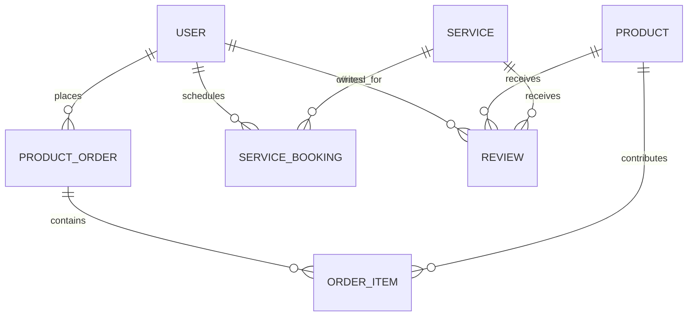
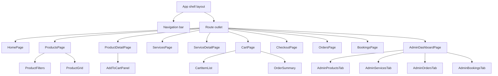

# Vetty Architecture & Delivery Plan

## 1. Personas and Core MVP Journeys

### Primary Personas
- **Pet Owner (Customer):** Needs quick access to veterinary products and services, transparent pricing, reliable delivery, and appointment visibility.
- **Admin Manager:** Curates catalog, oversees bookings and orders, monitors inventory, and resolves escalations.

### MVP Journey Map
1. **Onboarding & Authentication:** Users register/login with secure credential handling; admins log in through protected portal.
2. **Discover Catalog & Services:** Customers browse searchable product listings and service descriptions enriched with pricing and ratings.
3. **Cart & Checkout:** Customers add products to cart, adjust quantities, select delivery address, and submit checkout with preferred payment metadata (M-Pesa/Stripe token).
4. **Service Booking:** Customers request appointments by selecting service, timeslot, pet details, and contact information; admins review and approve/decline.
5. **Order & Booking Tracking:** Customers view status timelines; admins update fulfillment steps and manage delivery windows.
6. **Feedback Loop:** Customers submit ratings/reviews post fulfillment; admins monitor KPIs and address low ratings.

## 2. Domain Model & Relationships

### Entity Overview
| Model | Key Attributes | Relationships | Notes |
| --- | --- | --- | --- |
| `User` | role, name, email, password_digest, phone, default_address | has many `ProductOrder`, `ServiceBooking`, `Review`; admin role manages catalog | Role-based authorization; unique email constraint.
| `Product` | name, description, price_cents, stock_level, sku, image_url, is_active | has many `OrderItem`, `Review`; belongs to `User` (creator) | Stock tracking and soft delete flags.
| `Service` | title, description, base_price_cents, duration_minutes, is_active | has many `ServiceBooking`, `Review`; belongs to `User` (admin owner) | Supports scheduling rules.
| `ProductOrder` | order_number, status, subtotal_cents, tax_cents, delivery_fee_cents, total_cents, delivery_address, payment_reference | belongs to `User`; has many `OrderItem` | Status lifecycle: pending → approved → dispatched → delivered → cancelled.
| `OrderItem` | quantity, unit_price_cents, line_total_cents | belongs to `ProductOrder` and `Product` | Acts as order-product association with user-supplied quantity.
| `ServiceBooking` | appointment_at, status, pet_details, address, notes | belongs to `User` and `Service` | Join table fulfilling reciprocal many-to-many requirement with user-provided notes.
| `Review` | rating, comment, reviewable_type, reviewable_id | polymorphic belongs to `Product` or `Service`; belongs to `User` | Enables feedback for both catalog types.
| `InventoryMovement` (stretch) | delta, reason, reference_type, reference_id | belongs to `Product`, `User` | Audit trail for stock adjustments.

### Relationship Summary

## 3. Backend Architecture (Flask)

- **Stack:** Flask-RESTful, SQLAlchemy, Marshmallow (serialization/validation), Flask-Migrate, Flask-JWT-Extended, Flask-CORS.
- **Project Layout:**
  - `server/config.py` manages app factory, database, CORS, JWT config, logging.
  - `server/models/` package splits domain models (`user.py`, `product.py`, etc.) with SQLAlchemy mixins (timestamps, soft delete).
  - `server/schemas/` defines Marshmallow schemas for payload validation and serialization, enforcing data type and format rules (e.g., phone regex, positive pricing).
  - `server/resources/` hosts Flask-RESTful resources grouped by domain; each resource handles CRUD with request parsing and validation.
  - `server/services/` encapsulates domain logic (inventory adjustments, payment verification, booking conflicts) to keep resources thin.
  - `server/auth/` contains password hashing (Werkzeug), JWT token issuing, role guards, and refresh token logic.
- **Authentication & Authorization:**
  - Password hashing via Werkzeug; login issues access and refresh tokens with role claims.
  - Decorators or custom base resource ensure route-level authorization (e.g., admin-only catalog mutations).
- **Validation Strategy:**
  - Marshmallow schemas enforce required fields, data types (`fields.Decimal(as_string=True)` for currency, `fields.DateTime` for `appointment_at`).
  - Custom validators for M-Pesa reference format, phone number patterns, appointment time windows, and stock availability checks.
- **Key API Resources:**
  - `/api/auth/register`, `/api/auth/login`, `/api/auth/refresh`, `/api/auth/profile`.
  - `/api/products` (GET collection with filters, POST admin create), `/api/products/<id>` (GET, PATCH, DELETE admin).
  - `/api/services` & `/api/services/<id>` for CRUD with scheduling metadata.
  - `/api/orders` (GET user list, POST checkout), `/api/orders/<id>` (GET detail, PATCH status admin).
  - `/api/cart/preview` to price carts pre-checkout (server-side validation).
  - `/api/service-bookings` (POST create booking, GET user list), `/api/service-bookings/<id>` (PATCH status admin/user cancel).
  - `/api/reviews` for create/read, using reviewable polymorphism.
- **Background & Notifications (Stretch):** Celery worker or scheduled jobs to send reminders; not MVP-critical but design allows integration via event hooks.

## 4. Frontend Architecture (React + Redux Toolkit)

- **Routing Shell:** React Router v6 with protected routes for admin dashboard and authenticated features.
- **State Management:** Redux Toolkit slices (`auth`, `products`, `services`, `cart`, `orders`, `bookings`, `reviews`, `ui`). RTK Query or `createAsyncThunk` will manage API communication with shared base query (fetch wrapper adding JWT headers and error handling).
- **Component Strategy:**
  - **Pages:** `Home`, `Products`, `ProductDetail`, `Services`, `ServiceDetail`, `Cart`, `Checkout`, `Orders`, `Bookings`, `AdminDashboard` (with tabs for products, services, orders, bookings), `Auth` (login/register), `Profile`.
  - **Shared Components:** `AppShell`, `NavBar`, `ProtectedRoute`, `DataTable`, `FormSection`, `StatusBadge`, `RatingStars`, `NotificationBanner`.
- **Component Hierarchy Overview:**

- **Styling & UX:** Tailwind CSS or CSS Modules for responsive design; ensure mobile-first layouts. Include toast notifications for success/error states.

## 5. Formik Forms & Validation Strategy

| Form | Purpose | Key Validations (Yup) |
| --- | --- | --- |
| Registration | Capture user info | Email format, password strength, phone regex, confirm password match. |
| Login | Authentication | Required email/password, throttle after repeated failures. |
| Product Management (Admin) | Create/update products | Required name, positive numeric price, integer stock >= 0, image URL format. |
| Service Management (Admin) | Manage services | Required title, description length, positive duration, allowed status toggles. |
| Cart Checkout | Address and payment | Required address fields, delivery zone selection, payment reference pattern (`^[A-Z0-9]{10,12}$`). |
| Service Booking | Schedule appointments | Required service selection, appointment datetime within business windows, pet details length, contact phone verification. |
| Review Submission | Post feedback | Rating integer 1-5, comment optional but capped length, ensure order/booking completion. |

Formik will leverage reusable input components with inline errors, disabling submit until validation passes. Server validation feedback will map to Formik error bag.

## 6. Client-Server Data Flow & Error Handling

- **API Layer:** Centralized fetch wrapper handles JWT injection, refresh token flows, and unified error parsing. RTK Query baseQuery with `fetchBaseQuery` simplifies caching and invalidation tags for `Product`, `Order`, and `Service` data.
- **State Synchronization:**
  - `cart` slice persists locally (localStorage) until checkout succeeds, after which server confirmation refreshes state.
  - `orders` and `bookings` slices subscribe to polling or WebSocket (stretch) for live status updates; MVP uses interval polling via RTK Query refetch.
- **Error Handling:** Global `ErrorBoundary` for render failures, toast alerts for API errors, field-level errors for validation responses (422). Redirect unauthenticated users to `/auth` on 401.
- **Optimistic Updates:** Consider for admin status toggles with rollback on failure; keep high-risk operations (payments) pessimistic.

## 7. Testing Strategy (Jest & Minitest-Style)

- **Backend (Python Minitest-style):**
  - Use Python `unittest` with a Minitest-inspired base class to group test cases (`tests/test_users.py`, `tests/test_orders.py`).
  - Employ Flask testing client and in-memory SQLite (transaction per test) for fast API contract tests.
  - Coverage focus: authentication flows, permission checks, validation errors (price, phone, payment reference), booking conflict logic, inventory deductions.
  - Factories (Factory Boy) seed consistent fixtures; use Faker for sample data.
- **Frontend (Jest + React Testing Library):**
  - Component tests for forms ensuring Formik validation messaging and submit handlers.
  - Slice reducers thunk tests validating async logic and state transitions.
  - Integration tests for key routes (products, checkout, bookings) using MSW to mock API responses.
  - Accessibility checks via `jest-axe` on core pages.
- **Pipeline:** GitHub Actions runs linters (`flake8`, `eslint`), backend unit tests, frontend tests on pull requests.

## 8. Deployment & DevOps Considerations

- **Environments:**
  - Local development via `pipenv` and `npm`; `.env` files handled with python-dotenv and Vite/CRA env conventions.
  - Staging (optional) mirrors production database schema for QA.
- **Deployment Targets:**
  - Backend on Render (Flask Gunicorn service) connected to Render PostgreSQL, environment variables stored securely.
  - Frontend on Render Static Site or Netlify; build pipeline triggered from `main` branch.
- **Database Management:** Automated migrations through CI before deploy (`flask db upgrade`); backup policies for PostgreSQL.
- **Observability:** Structured logging (JSON) with log levels; integrate Sentry or Rollbar (stretch) for error tracking; uptime monitoring with health check endpoint.
- **Security:** Enforce HTTPS, secure cookie flags for refresh tokens, rate limiting on auth endpoints (Flask-Limiter), dependency scanning via Dependabot.

## 9. Vertical Slice Implementation Roadmap

| Milestone | Scope | Exit Criteria |
| --- | --- | --- |
| 1. Project Bootstrap | Repo setup, linting, CI scaffolding, base Flask/React apps running, database initialized. | Pipenv and npm dependencies installed; health endpoints responding; CI green. |
| 2. Authentication Slice | User model, JWT auth API, Register/Login UI with Formik, Redux auth slice. | Users can sign up/log in and persist session; protected routes gated. |
| 3. Product Catalog Slice | Product CRUD (admin), product listing/detail UI, cart slice foundation. | Products fetched with filters; admins manage inventory; add-to-cart updates state. |
| 4. Checkout Slice | Order models/controllers, checkout form, payment reference capture, order history page. | Users submit orders and view status; admins update order states. |
| 5. Service Booking Slice | Service model CRUD, booking workflows, approval management UI. | Users book services; admins approve/decline and statuses reflect in UI. |
| 6. Reviews & Feedback Slice | Review endpoints, UI components, rating display. | Users submit reviews after completion; average ratings surface on catalog cards. |
| 7. Admin Analytics Slice (Stretch) | Dashboard metrics, low-stock alerts, delivery zones configuration. | Admin dashboard charts display aggregated KPIs; notifications for low inventory. |
| 8. Testing & Hardening | Expand automated tests, load test critical endpoints, finalize error handling. | Target coverage thresholds met; QA checklist passed. |
| 9. Deployment & Launch | Production configuration, database migrations, monitoring setup, documentation polish. | App deployed with smoke tests completed; README and runbooks updated. |

